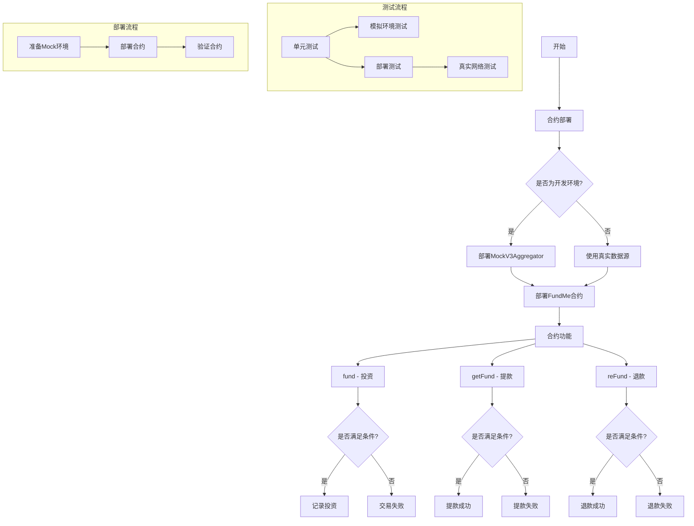

# Sample Hardhat Project

This project demonstrates a basic Hardhat use case. It comes with a sample contract, a test for that contract, and a Hardhat Ignition module that deploys that contract.

Try running some of the following tasks:

```shell
npx hardhat help
npx hardhat test
REPORT_GAS=true npx hardhat test
npx hardhat node
npx hardhat ignition deploy ./ignition/modules/Lock.js
```

# 项目解读

## 1. 智能合约

本项目主要包含一个众筹合约 `FundMe`，其核心功能如下：

- **众筹功能**：用户可以通过 `fund()` 函数向合约发送ETH进行投资
- **资金管理**：使用 `mapping(address => uint256)` 记录每个投资人的投资金额
- **众筹目标**：设定了众筹目标金额（TARGET）为10 ETH
- **锁定期机制**：合约部署时设定锁定期，在锁定期内用户可以投资，锁定期结束后：
  - 如果达到目标金额，项目所有者可以提取资金
  - 如果未达到目标金额，投资者可以申请退款
- **价格预言机**：使用Chainlink预言机获取ETH/USD价格，确保投资金额达到最低要求（2 USD）
- **权限控制**：使用修饰器（modifier）确保某些函数只能由合约所有者调用

此外，项目还包含一个模拟合约 `MockV3Aggregator`，用于在开发环境中模拟Chainlink预言机的行为。

## 2. 部署流程

项目使用hardhat-deploy插件管理部署流程，主要包含两个部署脚本：

- **00-deploy-mocks.js**：在开发环境（hardhat、local）中部署模拟的Chainlink预言机
- **01-deploy-fund-me.js**：部署主合约FundMe，根据不同网络环境使用不同的数据源：
  - 开发环境：使用模拟的预言机
  - 测试网/主网：使用真实的Chainlink预言机地址

部署配置在 `helper-hardhat-config.js` 中集中管理，包括：
- 开发链列表
- 锁定时间（180秒）
- 确认数（5个区块）
- 各网络的预言机地址配置

## 3. 测试框架

测试分为两个层次：

### 单元测试 (test/unit)
- 在模拟环境中进行，使用MockV3Aggregator模拟预言机
- 测试合约的各个功能点，包括：
  - 所有权验证
  - 数据源配置验证
  - fund函数在各种条件下的行为（窗口开启/关闭，金额是否满足最低要求）
  - getFund函数在各种条件下的行为（是否所有者，窗口是否关闭，是否达到目标）
  - reFund函数在各种条件下的行为（窗口是否关闭，是否达到目标，用户是否有余额）

### 集成测试 (test/staging)
- 在真实网络（如Sepolia测试网）上进行
- 测试完整的业务流程：
  - 投资并成功提款
  - 投资并成功退款

测试使用了多种辅助工具：
- hardhat-network-helpers：用于时间操作（增加区块时间）
- chai断言库：用于验证结果

## 4. Task系统

项目利用Hardhat的task系统创建了自定义命令，便于与合约交互：

- **deploy-fundme**：部署FundMe合约并在支持的网络上进行验证
- **interact-fundme**：与已部署的FundMe合约交互，包括：
  - 使用不同账户向合约发送资金
  - 查询合约余额
  - 查询投资人在合约中的余额记录

这些task可以通过命令行直接调用：`npx hardhat deploy-fundme` 或 `npx hardhat interact-fundme --addr <合约地址>`

## 5. 项目流程图


